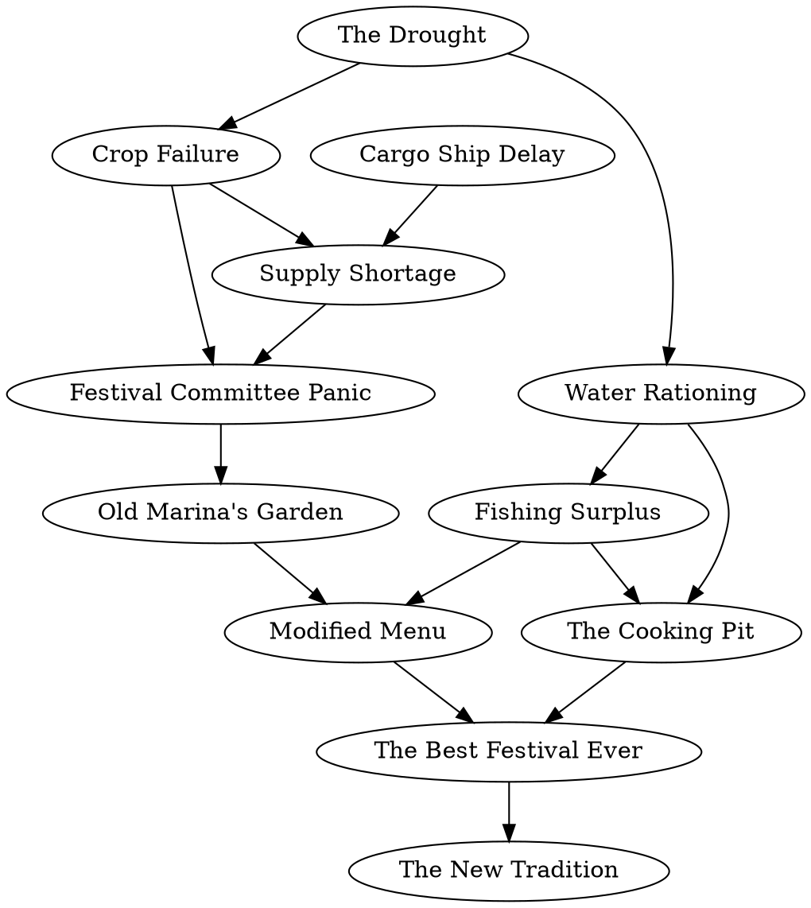
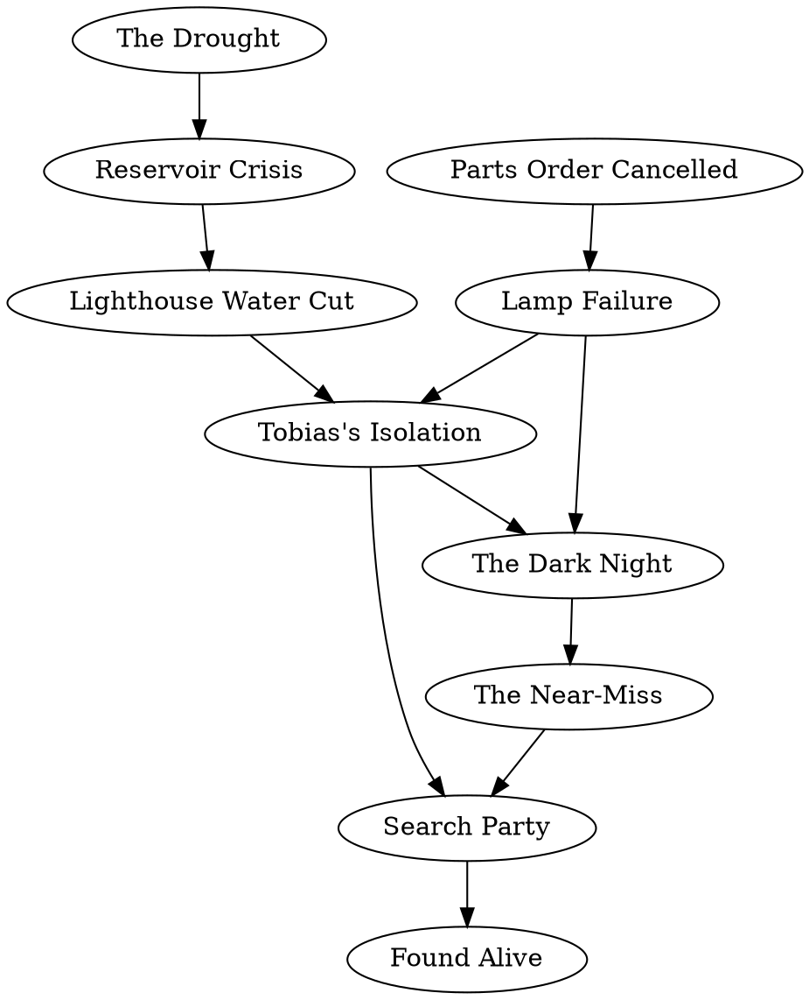
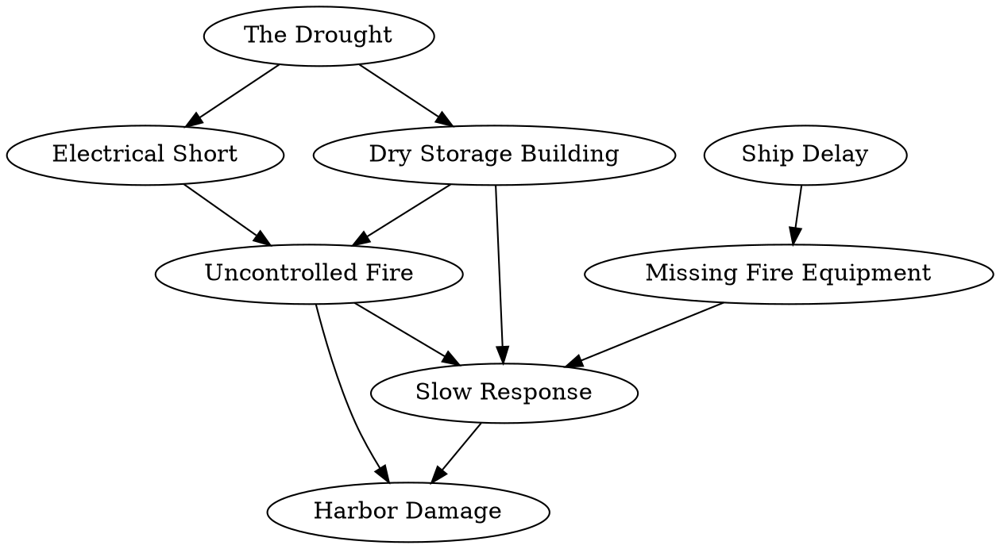

# Multiworld Mystery Scenario Pack Design

**Date**: 2026-03-02
**Status**: Design exploration
**Depends on**: [Connection Puzzle Design for DepGraph](connection-puzzle-depgraph.md)

---

## 1. Overview

This document extends the connection puzzle format from single-player puzzles into **interconnected multiworld mysteries**. Each player solves their own connection puzzle (a dependency graph displayed in the Proof Queue + Proof Graph panels), but the puzzles share a thematic story and players discover clues to each other's mysteries through normal Archipelago item distribution.

The key insight: **Archipelago's cross-world item randomization is inherently a clue-sharing mechanism.** When Player A checks a location in their world and receives an item for Player B, we can attach narrative content to that item that helps Player B solve their connection puzzle.

---

## 2. What Archipelago Already Provides

### 2.1 Cross-World Item Distribution

In a multiworld game, each player's item pool is randomized across all players' locations. When Player A checks a location, they might find:
- An item for their own world (self-found)
- An item for Player B's world (sent to Player B)

This is the fundamental mechanic. Items already flow between players. We attach meaning to them.

### 2.2 Available Data in rules.json

The frontend can load a combined rules.json containing **all players' data**:

```
rules.json
├── player_names: { "1": "Detective A", "2": "Detective B", "3": "Detective C" }
├── world["1"]: { slot_data: { graph_structure: {...} }, name_substitutions: {...} }
├── world["2"]: { slot_data: { graph_structure: {...} }, name_substitutions: {...} }
├── world["3"]: { slot_data: { graph_structure: {...} }, name_substitutions: {...} }
├── items["1"]: [ item definitions for player 1 ]
├── items["2"]: [ item definitions for player 2 ]
├── regions["1"]: { region definitions for player 1 }
└── regions["2"]: { region definitions for player 2 }
```

The stateManager stores the full file in `sm.rules` and publishes it via the `stateManager:rawJsonDataLoaded` event. Currently, only the current player's data is processed into static data, but the full multiworld context is available for new features.

### 2.3 Sphere Log (Cross-Player Progression)

The sphere log tracks progression across all players simultaneously:

```json
{
  "type": "state_update",
  "sphere_index": "0.2",
  "player_data": {
    "1": { "sphere_locations": ["Badge Seller - Item 1"], "new_inventory_details": {...} },
    "2": { "sphere_locations": [], "new_inventory_details": {...} },
    "3": { "sphere_locations": ["Old Building Race Reward"], "new_inventory_details": {...} }
  }
}
```

This enables us to know the order in which items flow between players.

### 2.4 Name Substitutions

Both MetaMath and DepGraph generate `name_substitutions` that map generic names to meaningful display names:

```json
{
  "items": { "Node 1": "Basic Combat", "Node 2": "Shield Block" },
  "locations": { "Complete Node 1": "Basic Combat", "Complete Node 2": "Shield Block" },
  "regions": { "Complete Node 1": "Basic Combat" }
}
```

For the mystery scenario pack, we can use name substitutions to give items thematic names that serve as clues.

### 2.5 Text Adventure Module

The existing text adventure module provides:
- Rich narrative rendering with HTML formatting and CSS styling
- Message types: normal, user-input, system, error, item-discovery
- Custom data files (JSON) with per-region, per-location, per-item narrative content
- Message template variables: `{regionName}`, `{locationName}`, `{item}`
- Clickable links for locations and exits with accessibility color-coding
- Command parser with fuzzy matching

This module can be extended to serve as the **clue journal** and **narrative delivery system**.

---

## 3. Design: How Mysteries Connect

### 3.1 The Core Loop

Each player in a multiworld mystery:
1. **Explores their own regions** (text adventure / standard UI)
2. **Finds items** — some for themselves, some for other players
3. **Receives items** from other players that contain **clue descriptions**
4. **Uses clues** to deduce edges in their **connection puzzle** (Proof Graph panel)
5. **Completing nodes** in their connection puzzle unlocks new regions to explore

The connection puzzle is the deduction layer. The item flow is the clue delivery layer. The text adventure (or standard UI) is the exploration layer.

### 3.2 Item Descriptions as Clues

The key new data field: **`item_description`** on items in the DepGraph world.

Currently, DepGraph items are generic ("Node 1", "Node 2") with name substitutions providing display names. We extend this: each item carries a `description` field in slot_data that the frontend displays when the item is received.

For cross-player items, the description contains a **clue about the receiving player's connection puzzle**. For example:

> Player A receives "Witness Statement" from Player B's world.
> Description: *"Mrs. Park saw the delivery truck arrive BEFORE the power went out. She's certain about this — she was watering her garden and the sprinklers were still running."*

This clue helps Player A deduce a specific edge in their connection graph (the delivery happened before the power outage, not because of it).

### 3.3 How Clue Items Map to Graph Edges

Each DepGraph node has dependencies (incoming edges). The player needs to figure out which edges to draw. Clue items provide evidence for specific edges:

```
Player A's graph has: Node 5 ("Supply Shortage") depends on Node 2 ("Ship Delay")
Player B finds an item in their world destined for Player A:
  Item name: "Harbormaster's Log"
  Description: "The cargo ship was delayed a full week. Port records show it
   was still docked when the store shelves emptied out."
```

This clue points toward the edge 2→5 in Player A's graph. The player still needs to figure out which nodes the clue refers to and draw the edge themselves.

### 3.4 Difficulty Tiers for Clues

| Tier | Clue Style | Example |
|------|-----------|---------|
| **Direct** | Names both endpoints | "The ship delay caused the supply shortage" |
| **Referential** | Describes endpoints by properties | "A maritime problem led to empty shelves" |
| **Evidential** | Provides evidence supporting the edge | "Port records show the ship was docked while shelves emptied" |
| **Circumstantial** | Provides partial/ambiguous evidence | "Something at the harbor happened around the same time the stores ran out" |

Higher tiers require more cross-referencing with node descriptions in the Queue panel.

### 3.5 Self-Found vs. Cross-Player Clues

- **Self-found items** (found in your own world, for your own world): provide **node descriptions** — the "What Happened" / "Why It Happened" text that appears in the Queue panel.
- **Cross-player items** (sent by another player): provide **edge clues** — evidence about specific connections between nodes.

This means players can't solve their puzzle alone. They need clues from other players to deduce certain edges. This creates genuine cooperative dependency without requiring direct communication.

---

## 4. Data Format Extensions

### 4.1 Extended slot_data for Mystery Scenarios

```json
{
  "graph_structure": {
    "1": {
      "label": "Power Outage",
      "expression": "The electricity went out across the whole street.",
      "full_text": "A summer storm knocked down a power line.",
      "dependencies": []
    },
    "2": {
      "label": "Ship Delay",
      "expression": "The mainland supply ship was held in port.",
      "full_text": "A mechanical failure, entirely unrelated to island events.",
      "dependencies": []
    },
    "5": {
      "label": "Supply Shortage",
      "expression": "Store shelves emptied out.",
      "full_text": "The island depends on what it grows and what the ship brings. Both failed.",
      "dependencies": [2, 3]
    }
  },
  "starting_nodes": [1, 2],
  "title": "The Festival That Almost Wasn't",
  "puzzle_type": "event_causation",

  "scenario_pack": {
    "scenario_name": "The Ravenport Mysteries",
    "player_role": "Detective Morrison",
    "mystery_title": "The Festival That Almost Wasn't",
    "mystery_brief": "A small island's harvest festival was nearly cancelled. Reconstruct the chain of events.",
    "item_descriptions": {
      "Node 1": "Your case file on the power outage. The storm was Act of God — no one's fault.",
      "Node 2": "A shipping manifest. The cargo vessel had engine trouble completely unrelated to the island.",
      "Node 3": "Crop yield reports. The harvest was devastatingly poor this year."
    },
    "cross_player_clues": {
      "Node 4": {
        "clue_text": "Council meeting minutes show the water rationing vote was unanimous and immediate after reservoir levels dropped.",
        "hints_at_edges": [[1, 4]],
        "clue_tier": "referential"
      },
      "Node 7": {
        "clue_text": "A fisherman's logbook: 'Ever since they stopped the irrigation pumps, the river mouth cleared right up. Haven't seen runs like this in twenty years.'",
        "hints_at_edges": [[4, 7]],
        "clue_tier": "evidential"
      }
    }
  }
}
```

### 4.2 Name Substitutions for Thematic Names

```json
{
  "items": {
    "Node 1": "Storm Report",
    "Node 2": "Shipping Manifest",
    "Node 3": "Crop Yield Data",
    "Node 4": "Rationing Decree",
    "Node 5": "Store Inventory Records"
  },
  "locations": {
    "Complete Node 1": "File: Storm Report",
    "Complete Node 2": "File: Shipping Manifest"
  }
}
```

When Player B finds "Shipping Manifest" in their world, the item has a thematic name that fits the mystery narrative. Player A receives it with the description from `item_descriptions`.

### 4.3 Custom Data for Text Adventure

A mystery-specific JSON file for the text adventure module:

```json
{
  "settings": {
    "enableDiscoveryMode": true,
    "messageHistoryLimit": 20
  },
  "regions": {
    "Menu": {
      "enterMessage": "You arrive at Ravenport Island. The harvest festival should have been yesterday, but something went wrong. Your job: figure out what happened.",
      "description": "The ferry dock. Salt air and the smell of fish."
    },
    "Complete Node 1": {
      "enterMessage": "You examine the power company's incident report. The grid failed at 2:47 PM — massive overload from air conditioning during the heatwave.",
      "description": "The power substation. Scorch marks on the transformer."
    }
  },
  "items": {
    "Storm Report": {
      "foundMessage": "You've obtained a key piece of evidence: the official storm damage assessment.",
      "description": "Filed by the power company. Documents the downed line."
    },
    "Council Meeting Minutes": {
      "foundMessage": "Detective Chen sent over council meeting minutes from last week. Interesting — the water rationing vote happened the same day the reservoir hit critical levels.",
      "description": "Cross-referenced with the drought timeline."
    }
  }
}
```

---

## 5. Sample Scenario: "The Ravenport Mysteries"

A 3-player cooperative mystery set on a fictional island town. Each player is a detective investigating a different incident. The incidents are interconnected — evidence from one case sheds light on the others.

### 5.1 Scenario Overview

| Player | Role | Mystery | Graph Size |
|--------|------|---------|------------|
| 1 | Detective Morrison | "The Festival That Almost Wasn't" | 12 nodes, 14 edges |
| 2 | Detective Chen | "The Lighthouse Keeper's Disappearance" | 10 nodes, 11 edges |
| 3 | Detective Okafor | "The Harbor Fire" | 8 nodes, 9 edges |

**Shared setting**: Ravenport Island, population ~2,000. A fishing and farming community.
**Shared timeline**: All three incidents occurred during the same week.
**Connections**: The drought (Player 1's root cause) also affected the lighthouse's water supply (Player 2) and dried out the harbor's fire-suppression system (Player 3). The cargo ship delay (Player 1's root cause) meant fire equipment wasn't delivered (Player 3) and the lighthouse keeper couldn't get replacement parts (Player 2).

### 5.2 Player 1 — "The Festival That Almost Wasn't"

This is the Medium event causation puzzle from the earlier design document, now embedded in a multiworld context.

**12 nodes, 14 edges.**

The graph structure is identical to the puzzle in `connection-puzzle-depgraph.md` §5.4. What changes is how clues are delivered:

**Self-found items** (6 of 12 nodes): Provide the "What Happened" / "Why It Happened" descriptions directly.

**Cross-player items** (6 of 12 nodes): Arrive from Players 2 and 3 with edge clues.

| Node | Item Name | Source | Clue |
|------|-----------|--------|------|
| 4 (Water Rationing) | "Rationing Decree" | Player 2 | *"While investigating the lighthouse, I found the council's emergency water decree. It was issued the same day the reservoir dropped below 15%. The drought made this inevitable."* |
| 7 (Fishing Surplus) | "Fisherman's Logbook" | Player 3 | *"A fisherman at the harbor told me catches tripled after they stopped running the irrigation pumps. Something about the river mouth clearing up."* |
| 8 (Marina's Garden) | "Marina's Pantry Inventory" | Player 2 | *"Interviewed Marina Kowalski about the lighthouse keeper. She mentioned she'd heard the festival committee was in crisis and offered her entire root cellar. She's been stockpiling for years."* |
| 9 (Modified Menu) | "Festival Menu Draft" | Player 3 | *"Found a crumpled menu draft at the harbor. Someone crossed out 'imported flour' and wrote 'grilled fish + root vegetables.' Looks like they worked with what they had."* |
| 10 (Cooking Pit) | "Beach Permit Application" | Player 2 | *"The council files show a last-minute permit for an open cooking fire on the beach. The application says 'community kitchen ovens offline due to rationing.' They needed the fire for the fish."* |
| 12 (New Tradition) | "Council Vote Record" | Player 3 | *"The council voted unanimously to make the beach cookout a permanent tradition. That festival must have really been something."* |

### 5.3 Player 2 — "The Lighthouse Keeper's Disappearance"

Old Tobias, the lighthouse keeper, vanished during the same week. His lighthouse went dark, endangering ships. Detective Chen must reconstruct what happened.

**10 nodes, 11 edges.**

#### Nodes

| # | Label | What Happened | Why It Happened |
|---|-------|---------------|-----------------|
| 1 | The Drought | "Three months without rain." | "Climate patterns. The whole island suffered." |
| 2 | Parts Order Cancelled | "Tobias's order for lighthouse lamp parts was cancelled by the supplier." | "He'd ordered months ago, but the company went through 'restructuring.' His small order was dropped. Nothing to do with the island." |
| 3 | Reservoir Crisis | "The island's water supply dropped to critical levels." | "No rain for three months. The reservoir wasn't designed for a drought this long." |
| 4 | Lighthouse Water Cut | "The lighthouse's water supply was disconnected." | "When rationing hit, remote buildings were cut first. The lighthouse was deemed non-residential." |
| 5 | Lamp Failure | "The lighthouse lamp began flickering, then dimmed to half power." | "The lamp assembly was old and needed the replacement parts. Without them, it slowly degraded." |
| 6 | Tobias's Isolation | "Tobias stopped coming to town. No one saw him for five days." | "With no running water and a failing lamp, he refused to leave his post. He carried water from the tide pools and tried to fix the lamp himself." |
| 7 | The Dark Night | "The lighthouse went completely dark on Tuesday night." | "The lamp finally gave out entirely. And with Tobias weakened from days of hauling seawater, he couldn't operate the manual backup." |
| 8 | The Near-Miss | "A fishing trawler nearly ran aground on the rocks." | "No lighthouse beacon. The captain was navigating by memory in fog and almost didn't see the rocks." |
| 9 | Search Party | "Twenty islanders formed a search party at dawn." | "The trawler captain radioed in about the dark lighthouse. The harbormaster knew Tobias hadn't been seen in days. Both facts triggered the alarm." |
| 10 | Found Alive | "Tobias was found dehydrated but alive in the lamp room." | "The search party reached the lighthouse. He'd been rationing his tide-pool water and trying to repair the lamp by hand. He hadn't called for help because the radio needed the same power the lamp did." |

#### Answer

```
Roots: 1 (Drought), 2 (Parts Order)

1──→3           [Drought → reservoir crisis]
3──→4           [Reservoir crisis → water cut to lighthouse]
2──→5           [Cancelled parts → lamp degradation]
4──→6, 5──→6   [No water + failing lamp → Tobias stays at lighthouse]
5──→7, 6──→7   [Lamp dies + Tobias too weak → dark night]
7──→8           [Dark lighthouse → near-miss]
8──→9, 6──→9   [Near-miss report + Tobias not seen → search party]
9──→10          [Search party → found alive]
```

#### Cross-Player Clues Received

| Node | Item Name | Source | Clue |
|------|-----------|--------|------|
| 3 (Reservoir Crisis) | "Water Level Charts" | Player 1 | *"The festival investigation uncovered reservoir data. It hit critical levels after three months of drought. That's when the council started cutting off non-essential buildings."* |
| 4 (Water Cut) | "Utility Disconnect Notice" | Player 3 | *"Found a utility disconnection order at the harbor office. The lighthouse and the harbor fire station were both cut off on the same day under emergency rationing."* |
| 8 (Near-Miss) | "Coast Guard Report" | Player 3 | *"The harbor fire investigation turned up a coast guard log. A trawler reported navigating past the lighthouse rocks with no beacon on Tuesday night. They barely made it."* |
| 9 (Search Party) | "Harbormaster's Radio Log" | Player 1 | *"The harbormaster received the trawler captain's distress call and immediately asked when anyone had last seen old Tobias. The answer — five days — is what launched the search."* |

### 5.4 Player 3 — "The Harbor Fire"

A fire broke out in the harbor storage building, destroying supplies and fishing equipment. Detective Okafor must determine the chain of events.

**8 nodes, 9 edges.**

#### Nodes

| # | Label | What Happened | Why It Happened |
|---|-------|---------------|-----------------|
| 1 | The Drought | "Three months of extreme heat and no rain." | "Weather. The whole island was a tinderbox." |
| 2 | Ship Delay | "The mainland supply vessel was stuck in port." | "Engine trouble. Entirely mechanical, entirely mainland." |
| 3 | Dry Storage Building | "The harbor storage building's fire-suppression sprinklers were empty." | "The sprinkler system runs off the municipal water supply. With rationing in effect, the pressure dropped to zero in all non-essential systems." |
| 4 | Missing Fire Equipment | "The volunteer fire station's backup extinguishers were expired and empty." | "New equipment was on order. It was supposed to arrive on the supply ship. The ship that didn't come." |
| 5 | Electrical Short | "An electrical short sparked in the storage building's old wiring." | "The wiring was decades old. The heat caused expansion in the conduit. This was bound to happen eventually, drought or not — but the timing was terrible." |
| 6 | Uncontrolled Fire | "The fire spread rapidly through the storage building." | "A spark in a bone-dry building with no working sprinklers. It was over in minutes." |
| 7 | Slow Response | "The volunteer firefighters arrived but couldn't contain the blaze." | "No water pressure for hoses, expired extinguishers, and a fire already out of control by the time they got there." |
| 8 | Harbor Damage Assessment | "The storage building was destroyed. Three boats damaged. No injuries." | "The fire couldn't be stopped, but the volunteers evacuated everyone in time. The boats were damaged by radiant heat. Everything in the building was lost." |

#### Answer

```
Roots: 1 (Drought), 2 (Ship Delay), 5 (Electrical Short)

1──→3           [Drought → rationing → empty sprinklers]
2──→4           [Ship delay → fire equipment not delivered]
1──→5           [Drought/heat → wiring expansion → spark]
3──→6, 5──→6   [Empty sprinklers + spark → fire spreads]
4──→7, 6──→7   [No equipment + fire already spreading → slow response]
3──→7           [No water pressure → can't use hoses either]
7──→8           [Uncontained fire → damage]
6──→8           [Rapid fire → boat damage from radiant heat]
```

#### Cross-Player Clues Received

| Node | Item Name | Source | Clue |
|------|-----------|--------|------|
| 3 (Dry Sprinklers) | "Municipal Water Pressure Log" | Player 1 | *"Festival investigation records show municipal water pressure dropped to zero in non-residential buildings on the same day rationing was declared. The drought drained the system."* |
| 4 (Missing Equipment) | "Shipping Manifest (Undelivered)" | Player 2 | *"While investigating the lighthouse parts order, I found the full cargo manifest for the delayed ship. Fire extinguishers for the volunteer station were on it. The ship was still in port when the fire broke out."* |
| 5 (Electrical Short) | "Building Inspector's Note" | Player 1 | *"A building inspector flagged the storage building's wiring two years ago. The note says the conduit expands dangerously in extreme heat. The sustained heatwave would have been the final straw."* |
| 7 (Slow Response) | "Fire Chief's After-Action Report" | Player 2 | *"The fire chief's report is damning: no water pressure, expired extinguishers, and the fire was fully involved before the first volunteer arrived. Three independent failures, all at once."* |

### 5.5 How the Mysteries Interconnect

The three mysteries share root causes that ripple through all three stories:

```
                    THE DROUGHT (shared root)
                   /          |            \
                  v           v             v
           P1: Crop      P2: Reservoir   P3: Dry
           Failure       Crisis          Building
              |             |               |
              v             v               v
           P1: Supply   P2: Water Cut   P3: Empty
           Shortage     to Lighthouse   Sprinklers
              |             |               |
              v             v               v
           (cascades)   (cascades)      (cascades)

                  SHIP DELAY (shared root)
                  /          \
                 v            v
           P1: Supply     P3: Missing
           Shortage       Fire Equipment
              |               |
              v               v
           (cascades)     (cascades)
```

Players discover these connections through the clue items they exchange. When Detective Morrison (P1) receives "Water Level Charts" from Detective Chen (P2), they learn that the reservoir crisis in P2's story connects to the same drought in their own story. The shared root causes create a satisfying "aha" when players discuss their mysteries.

### 5.6 Cross-Player Clue Distribution

In a 3-player multiworld, items are randomized across all three worlds. The scenario pack needs approximately:

| Player | Total Nodes | Self-Found | From P1 | From P2 | From P3 |
|--------|-------------|------------|---------|---------|---------|
| P1 | 12 | 6 | — | 3 | 3 |
| P2 | 10 | 6 | 2 | — | 2 |
| P3 | 8 | 4 | 2 | 2 | — |

The Archipelago randomizer distributes items across worlds. The graph files used by each DepGraph world would have 30 total nodes across all three players. Archipelago handles the randomization — we don't control *which* specific locations contain cross-player items, but every item eventually reaches its destination.

The `name_substitutions` ensure items display with thematic names. The `item_descriptions` (new field) provide clue text when items are received.

---

## 6. Frontend Implementation Concepts

### 6.1 Clue Journal Module (New)

A new frontend module that aggregates all received clue items and displays them in context:

**Features:**
- Lists all received items with their descriptions, grouped by source player
- Highlights which items are "clues from other detectives" vs "your own evidence"
- Links items to specific nodes in the connection puzzle (optional hint feature)
- Shows a timeline of when clues were received

**Data source:** The module reads `scenario_pack.item_descriptions` and `scenario_pack.cross_player_clues` from `sm.rules.world[playerId].slot_data` for the current player, and accesses `sm.rules.player_names` for other players' display names.

### 6.2 Extended Text Adventure Narratives

The text adventure module already supports custom data files with per-region narrative content. For mystery scenarios:

- Each region (DepGraph node) gets a narrative description
- Location checks reveal evidence with thematic text
- Item discovery messages include clue context
- The command parser could be extended with mystery-specific commands: `deduce`, `review clues`, `case notes`

### 6.3 Cross-Player Awareness Panel (New or Extension)

Using the full multiworld rules.json data, a panel could show:

- Other players' mystery titles and brief descriptions
- Items you've sent to other players (and vice versa)
- A simplified view of other players' graph progress (how many edges they've drawn)
- Shared timeline of evidence discovery

**Data source:** `sm.rules.world` contains all players' data. `sm.rules.player_names` maps IDs to names. The sphere log tracks cross-player item flow.

### 6.4 Connection Graph Enhancements for Mysteries

The existing Proof Graph panel (Cytoscape.js) could be enhanced:

- **Clue overlay**: When a clue item is received, the relevant nodes pulse or highlight
- **Confidence markers**: Player marks edges as "confirmed" vs "tentative"
- **Evidence tooltips**: Hovering over an edge shows the clue(s) that support it
- **Cross-mystery nodes**: Shared root causes (Drought, Ship Delay) appear with a distinctive style indicating they exist in multiple players' puzzles

---

## 7. DepGraph World Extensions

### 7.1 Scenario Pack Graph Files

The DepGraph world already supports multiple graph formats (DOT, JSON, CSV). A scenario pack would include:

```
worlds/depgraph/data/scenarios/ravenport/
├── scenario.json              # Scenario metadata and clue mappings
├── festival.dot               # Player 1's graph
├── lighthouse.dot             # Player 2's graph
├── harbor_fire.dot            # Player 3's graph
├── festival_narrative.json    # Text adventure custom data for P1
├── lighthouse_narrative.json  # Text adventure custom data for P2
└── harbor_fire_narrative.json # Text adventure custom data for P3
```

### 7.2 Graph File: festival.dot (Player 1)



### 7.3 Graph File: lighthouse.dot (Player 2)



### 7.4 Graph File: harbor_fire.dot (Player 3)



### 7.5 Scenario Metadata: scenario.json

```json
{
  "scenario_name": "The Ravenport Mysteries",
  "description": "Three detectives investigate three incidents on Ravenport Island during the same catastrophic week. As each detective uncovers evidence, they discover that the incidents are connected — and that the clues to one mystery lie in another.",
  "num_players": 3,
  "players": {
    "1": {
      "role": "Detective Morrison",
      "mystery_title": "The Festival That Almost Wasn't",
      "graph_file": "festival.dot",
      "narrative_file": "festival_narrative.json",
      "mystery_brief": "The island's annual harvest festival was nearly cancelled. A cascade of failures turned into an improvised triumph. Reconstruct the chain of events."
    },
    "2": {
      "role": "Detective Chen",
      "mystery_title": "The Lighthouse Keeper's Disappearance",
      "graph_file": "lighthouse.dot",
      "narrative_file": "lighthouse_narrative.json",
      "mystery_brief": "Old Tobias hasn't been seen in five days. The lighthouse is dark. What happened to the keeper?"
    },
    "3": {
      "role": "Detective Okafor",
      "mystery_title": "The Harbor Fire",
      "graph_file": "harbor_fire.dot",
      "narrative_file": "harbor_fire_narrative.json",
      "mystery_brief": "A fire destroyed the harbor storage building. Was it preventable? Trace the chain of failures."
    }
  },
  "shared_elements": {
    "setting": "Ravenport Island, population ~2,000. Fishing and farming community.",
    "timeframe": "One catastrophic week in late summer.",
    "shared_root_causes": [
      {
        "name": "The Drought",
        "affects_players": [1, 2, 3],
        "description": "Three months without rain that drained the reservoir, dried the fields, and turned the island into a tinderbox."
      },
      {
        "name": "The Cargo Ship Delay",
        "affects_players": [1, 3],
        "description": "Engine failure kept the supply ship in port for a week, delaying deliveries of food and fire equipment."
      }
    ]
  },
  "cross_player_clue_map": {
    "1": {
      "from_2": ["Node 4", "Node 8", "Node 10"],
      "from_3": ["Node 7", "Node 9", "Node 12"]
    },
    "2": {
      "from_1": ["Node 3", "Node 9"],
      "from_3": ["Node 4", "Node 8"]
    },
    "3": {
      "from_1": ["Node 3", "Node 5"],
      "from_2": ["Node 4", "Node 7"]
    }
  }
}
```

---

## 8. Implementation Approach

### Phase 1: Data Format (DepGraph World Changes)
- Add `scenario_pack` section to slot_data in `fill_slot_data()`
- Add `item_descriptions` to name_substitutions or slot_data
- Add scenario graph files to `worlds/depgraph/data/scenarios/`
- Add a DepGraph option to select a scenario pack
- Ensure cross-player item distribution works correctly when multiple DepGraph worlds are in the same multiworld

### Phase 2: Frontend — Clue Display
- Extend the Proof Queue panel to display `item_descriptions` when items are received
- Add an `item_description` field that shows in the Queue panel's node detail view
- Highlight newly received clue items
- Differentiate "self-found evidence" from "received from another detective"

### Phase 3: Frontend — Narrative Layer
- Create text adventure custom data files for each scenario
- Extend text adventure module with mystery-themed commands
- Show cross-player context ("Detective Chen sent you this evidence")

### Phase 4: Frontend — Cross-Player Awareness
- Read `sm.rules.world` for all players' scenario data
- Display other players' mystery titles and roles
- Show a combined evidence timeline
- Optional: simplified view of other players' progress

### Phase 5: Scenario Authoring Tools
- A tool or template for creating new scenario packs
- Validation that cross-player clue mappings are consistent
- Graph visualization of the meta-structure (how mysteries connect)

---

## 9. Design Principles

1. **No server changes required.** Everything works through items, locations, name substitutions, and slot_data — all existing Archipelago mechanisms.

2. **The event bus is frontend-only.** Cross-player communication happens through Archipelago's item distribution, not through frontend events.

3. **Proof Queue and Proof Graph stay focused.** They display connection puzzles. Mystery features are in new modules (Clue Journal) or extensions to existing ones (Text Adventure).

4. **The full rules.json is the data source.** The frontend already loads it and stores it in `sm.rules`. New modules read other players' data from there.

5. **Progressive disclosure.** Players don't see all clues at once. As they explore and as other players send items, the picture gradually builds. This is inherent in Archipelago's sphere-based progression.

6. **Works without communication.** Players don't need to chat. The clue items themselves carry all the information needed. But discussing the cases makes it more fun — that's emergent gameplay, not a requirement.

7. **Scales to different group sizes.** The scenario pack defines 3 players, but the format supports 2-6+ players by adjusting how many mysteries exist and how clues are distributed.

---

## 10. Future Directions

### Alternative Scenario Themes
- **Heist**: Each player plans a different aspect of a heist (the vault, the getaway, the distraction). Clues reveal timing constraints.
- **Archaeological Dig**: Each player excavates a different layer. Items from deeper layers provide context for upper layers.
- **Murder Mystery**: Classic whodunit where each player investigates different suspects. Cross-player clues eliminate possibilities.
- **Disaster Response**: Each player manages a different emergency service during a natural disaster. Dependencies reveal which services needed to coordinate.

### Competitive Variants
- **Racing mysteries**: Same mystery, different randomizations. First to complete wins.
- **Adversarial clues**: One player is the "mastermind" who designed the puzzle. Others cooperate to solve it.

### Expanded Narrative Integration
- **Branching narratives**: Different edge-drawing orders reveal different story perspectives
- **Red herrings**: Some received items are deliberately misleading (but distinguishable through careful reasoning)
- **Hidden nodes**: Some graph nodes only appear after enough edges are drawn, revealing plot twists
