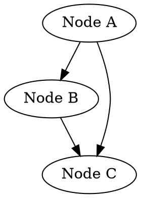

# DepGraph APWorld

Turn any directed acyclic graph (DAG) into a playable Archipelago world. Nodes become items and locations, edges become access rules. Includes bundled example graphs and supports custom graphs in JSON, DOT, or CSV format.

## How It Works

Any dependency graph can be converted into an Archipelago world:

- **Nodes** become both a location (something to complete) and an item (the ability it unlocks)
- **Edges** become access rules — you can't reach a node's region until its dependencies are satisfied
- **The final node** (last in topological order) is the completion condition
- **Multiworld integration** distributes items across players, so completing a task in your world might send a key unlock to another player's world

The JSON Tools web client serves as the game client — its Proof Queue and Proof Graph modules (shared with MetaMath) provide an interface for navigating the dependency graph and checking locations. You can also use any of the alternate game modes (Text Adventure, Loops) or manually mark tasks complete in the tracker.

## Quick Start

### 1. Create a YAML template

```yaml
name: YourName
game: DepGraph

DepGraph:
  graph_file: tech_tree
  entrance_rule_mode: relaxed_items
```

### 2. Generate a seed

```bash
python Generate.py --weights_file_path "Templates/DepGraph.yaml" --multi 1 --seed 1
```

### 3. Play

Open the JSON Tools web client with the `?mode=depgraph` parameter, or load the generated preset manually. The Proof Queue and Proof Graph modules provide a dedicated interface for navigating the dependency graph. The region graph shows nodes as regions with locations to check as you collect dependency items.

## Graph-to-World Conversion

Understanding how DepGraph maps graph concepts to Archipelago concepts:

### Structure Mapping

| Graph Concept | Archipelago Concept | Example |
|---------------|---------------------|---------|
| Node | Region + Location + Item | "Smelting" becomes region `Complete Node 4`, location `Complete Node 4`, item `Node 4` |
| Edge (A → B) | Entrance from A's region to B's region | Region for "Mining" connects to region for "Smelting" |
| Root node (no deps) | Region connected to Menu | "Basic Tools" is accessible from the start |
| Final node | Completion condition | Collecting the final node's event item wins the game |

### Internal Naming

Internally, DepGraph uses generic names for datapackage compatibility:

- Items: `Node 1`, `Node 2`, ... `Node N`
- Locations/Regions: `Complete Node 1`, `Complete Node 2`, ...
- Event items: `Completed Node 1`, `Completed Node 2`, ...

The client displays meaningful names (from the graph's labels) via name substitutions sent in slot data.

### Node Lifecycle

For each non-starting node:

1. A **region** is created (e.g., `Complete Node 4`)
2. A **location** is placed in that region with the node's ID
3. An **event location** is also placed, holding a locked `Completed Node 4` event item
4. A **progression item** (`Node 4`) is added to the item pool for randomization
5. **Entrances** connect from each dependency's region to this region

When you check the location, you receive whatever item was randomized there. The event item is automatically granted when you enter the region, marking the node as "completed" for downstream dependency checks.

### Starting Nodes

Starting nodes are pre-collected — both the node item and the completion event are given to the player at the start. They have no locations to check. The number of starting nodes is controlled by the `starting_nodes` percentage option (always at least 1).

### Completion Condition

The game is won when the player has the `Completed Node N` event for the final node (the last node in topological order). The final node's item is always locked in its own location (not randomized).

## Bundled Example Graphs

| Graph | Nodes | Format | Description |
|-------|-------|--------|-------------|
| `tech_tree` | 10 | JSON | Technology progression from Basic Tools through Mining/Logging, Smelting/Carpentry, to Industrial Age. Demonstrates convergence (Metalworking requires both Smelting and Carpentry). |
| `skill_tree` | 12 | DOT | RPG warrior skill tree from Basic Combat through branching Strength/Agility paths, reconverging at Warrior Stance, to Legendary Hero. |
| `recipe_chain` | 8 | CSV | Alchemy recipe chain from Gather Herbs and Purify Water through extracts and tinctures to Master Elixir. |
| `baking_adventure` | 15 | JSON | Cookie baking as a dependency graph: 6 root nodes (equipment and butter) feed into ingredient preparation, dough mixing, shaping, and baking. Multiple convergence points. |
| `coding_adventure` | 61 | JSON | Full-stack web development curriculum. 5 root nodes (HTML, JavaScript, Server Basics, Git, Command Line) branch into frontend (CSS, React, Vue), backend (Express, Django, Flask), database (SQL, NoSQL), testing, DevOps, and security paths, converging at Production Deployment. |

### Tech Tree Example

```
Basic Tools
├── Mining → Smelting ──┐
│                       ├── Metalworking ──┬── Architecture ──┐
└── Logging → Carpentry ┘                 └── Engineering ───┼── Steam Power → Industrial Age
```

## Custom Graph Formats

You can provide a path to your own graph file. The format is auto-detected by file extension.

### JSON Format (`.json`)

```json
{
    "title": "My Graph",
    "nodes": {
        "node_a": {
            "label": "Node A",
            "description": "First node — a root with no dependencies",
            "depends_on": []
        },
        "node_b": {
            "label": "Node B",
            "description": "Depends on A",
            "depends_on": ["node_a"]
        },
        "node_c": {
            "label": "Node C",
            "description": "Convergence: depends on both A and B",
            "depends_on": ["node_a", "node_b"]
        }
    }
}
```

| Field | Required | Description |
|-------|----------|-------------|
| `title` | No | Graph display name (defaults to filename) |
| `nodes` | Yes | Object of node objects keyed by ID |
| `nodes.*.label` | No | Display name (defaults to node ID) |
| `nodes.*.description` | No | Long description text |
| `nodes.*.depends_on` | No | Array of node IDs this node depends on |

All dependency references are validated — referencing a nonexistent node ID raises an error.

### DOT Format (`.dot`, `.gv`)



Edges represent dependency direction: `a -> b` means B depends on A. Node labels are optional — without a `label` attribute, the node ID is used as the display name. Supports basic DOT syntax only (no subgraphs, no complex attributes).

### CSV Format (`.csv`)

```csv
id,label,depends_on,description
gather_herbs,Gather Herbs,,Collect medicinal herbs
purify_water,Purify Water,,Create purified water
stabilizer,Stabilizer,gather_herbs;purify_water,Prevents potion decay
```

| Column | Required | Description |
|--------|----------|-------------|
| `id` | Yes | Unique node identifier |
| `label` | No | Display name (defaults to ID) |
| `depends_on` | No | Semicolon-separated list of dependency IDs |
| `description` | No | Description text |

### Graph Requirements

All three formats share these requirements:

- The graph must be a **directed acyclic graph** (no cycles). Cycles are detected via topological sort and raise an error.
- All dependency references must point to nodes that exist in the graph.
- At least one root node (no dependencies) must exist.
- Nodes are automatically topologically sorted — the order in the source file doesn't matter.

## Configuration

### All Options

| Option | Type | Default | Description |
|--------|------|---------|-------------|
| `graph_file` | TextChoice | `coding_adventure` | Bundled graph name or path to a custom file |
| `vanilla_placement` | Toggle | false | Items stay in their original nodes (no randomization) |
| `randomize_items` | Toggle | true | Shuffle items across locations |
| `randomize_starting_nodes` | Toggle | true | Starting nodes are random (true) or sequential (false) |
| `starting_nodes` | Range 0–50 | 0 | Percentage of nodes pre-unlocked at start |
| `entrance_rule_mode` | Choice | `relaxed_items` | How convergence nodes handle entrance rules |

### Entrance Rule Mode

This option controls how entrances to convergence nodes (nodes with multiple dependencies) are gated. It's the most important option for multiworld compatibility.

Consider a node C that depends on both A and B. Node C's region has two entrances: one from A's region, one from B's region.

| Mode | Entrance from A requires | Entrance from B requires | Notes |
|------|-------------------------|-------------------------|-------|
| **strict** (0) | All of: Event A, Event B, Item A, Item B | All of: Event A, Event B, Item A, Item B | Faithful to graph logic. May cause multiworld fill failures on large convergence gates. |
| **relaxed_items** (1) | All of: Event A, Event B, Item A | All of: Event A, Event B, Item B | Default. Preserves requirement to visit all prerequisites. Gives the fill algorithm flexibility. |
| **relaxed_events** (2) | All of: Item A, Item B, Event A | All of: Item A, Item B, Event B | Inverse of relaxed_items. |
| **fully_relaxed** (3) | Event A, Item A | Event B, Item B | Any single completed branch can enter. Least faithful to graph structure. |

**Recommendation**: Use `relaxed_items` (default) for multiworld. Use `strict` for solo play when you want exact graph fidelity.

The modes are implemented as a 2-bit field: bit 0 = relax items, bit 1 = relax events. This means `relaxed_items` (1) relaxes item requirements per-entrance while keeping events strict, and `relaxed_events` (2) does the opposite.

### Difficulty Tuning

```yaml
# Easiest: 50% of nodes pre-unlocked, in sequential order
starting_nodes: 50
randomize_starting_nodes: false

# Moderate: 20% pre-unlocked, randomly chosen
starting_nodes: 20
randomize_starting_nodes: true

# Hardest: only 1 root node to start from
starting_nodes: 0
```

When `randomize_starting_nodes` is false, starting nodes are the first N nodes in topological order (the roots and early nodes). When true, they're randomly selected from throughout the graph, which can leave you with scattered starting points and longer paths to the final node.

### Vanilla Placement

When `vanilla_placement` is enabled:
- `randomize_items` is forced to false
- `starting_nodes` is forced to 0
- Items are locked in their original node locations
- Accessibility is set to `minimal`

This produces a non-randomized playthrough that follows the original graph order exactly.

## Task List Converter

The bundled `tasklist_to_depgraph` tool converts flat to-do lists into dependency graphs. This lets you turn any list of tasks into a playable Archipelago game.

### Conversion Strategies

| Strategy | Flag | Best For | How It Works |
|----------|------|----------|-------------|
| **Layered** | `--approach layered` | Daily routines | Tasks divided into horizontal layers with cross-connections between layers |
| **Sparse** | `--approach sparse` | Organic variety | Each task randomly picks 0–N earlier tasks as dependencies |
| **Priority** | `--approach priority` | Mixed urgency | Groups by `[high]`/`[med]`/`[low]` tags; high-priority tasks become roots |
| **Categories** | `--approach categories` | Grouped tasks | Groups by `@category` tags; creates chains within each category with optional cross-links |

### Input Formats

**Plain text** — one task per line:
```
Do laundry
Clean kitchen
Walk the dog
```

**Priority-tagged** — for the `priority` approach:
```
[high] Pay rent
[med] Grocery shopping
[low] Organize bookshelf
```

**Category-tagged** — for the `categories` approach:
```
@cleaning Vacuum living room
@cleaning Mop kitchen
@errands Pick up prescription
@errands Return library books
```

**JSON** — full control over attributes:
```json
[
  {"name": "Task A", "priority": "high", "category": "work"},
  {"name": "Task B", "priority": "med", "category": "home"}
]
```

### Usage

```bash
python worlds/depgraph/tasklist/tasklist_to_depgraph.py tasks.txt \
  --approach layered \
  --output my_graph.json \
  --title "My Day" \
  --roots-percent 30 \
  --max-deps 2 \
  --seed 42
```

Key options:

| Option | Default | Description |
|--------|---------|-------------|
| `--approach` | `layered` | Conversion strategy |
| `--output` | stdout | Output file path |
| `--title` | `"Task Graph"` | Graph title |
| `--roots-percent` | 30 | Percentage of tasks that are roots |
| `--max-deps` | 2 | Maximum dependencies per task |
| `--cross-link-percent` | 30 | Cross-category link probability (categories approach) |
| `--seed` | random | Random seed for reproducibility |
| `--no-final-node` | false | Skip adding a synthetic "Day Complete!" convergence node |
| `--dry-run` | false | Preview without writing |

The output is a standard DepGraph JSON file that can be used directly with the `graph_file` option.

## Multiworld Behavior

### Item Distribution

In multiworld, DepGraph items are shuffled into the global item pool alongside items from other games. This means:

- Checking a node in your DepGraph world might give you an item for another player's game
- Another player checking a location in their game might send you a DepGraph node item
- The fill algorithm needs to be able to place items in a valid order — this is why `entrance_rule_mode` matters

### Fill Compatibility

The `strict` entrance rule mode can cause fill failures when a convergence node requires many items simultaneously. The fill algorithm may not be able to find a valid placement order. The `relaxed_items` mode (default) solves this by reducing per-entrance requirements while preserving the overall dependency structure.

### Slot Data

DepGraph sends the full graph structure to the client in slot data, enabling the tracker to display meaningful node names and dependency relationships:

```json
{
  "graph_structure": {
    "1": {
      "label": "basic_tools",
      "expression": "Basic Tools",
      "dependencies": [],
      "full_text": "basic_tools: Craft primitive tools from stone and wood"
    }
  },
  "starting_nodes": [1],
  "title": "Tech Tree",
  "randomize_items": true,
  "vanilla_placement": false
}
```

## Comparison with Similar APWorlds

| Feature | DepGraph | MetaMath | Manual APWorld |
|---------|----------|----------|----------------|
| Source | Any DAG | Metamath proofs | Handwritten YAML |
| Node creation | Automatic from graph | Automatic from proof tree | Manual |
| Dependencies | Graph edges | Proof step references | Manual rules |
| Custom graphs | JSON, DOT, CSV | Any Metamath theorem | N/A |
| Task list support | Yes (converter tool) | No | No |
| Convergence handling | 4 entrance rule modes | N/A | Manual |
| Graph size | Any (tested up to 61) | 2 to 45,000+ | Manual |

## Further Reading

- [Setup Guide](../../../worlds/depgraph/docs/setup_en.md) — Installation and configuration
- [Task List Converter](../../../worlds/depgraph/tasklist/README.md) — Detailed guide for converting task lists
