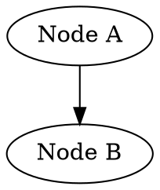

# DepGraph Setup Guide

## Prerequisites

### Required Software
- **Archipelago** 0.6.4 or later
- **Python** 3.8 or later

No additional libraries are required.

## Installation Steps

### 1. Install the DepGraph World

Place the `depgraph` folder in your Archipelago `worlds` directory:

```
Archipelago/
├── worlds/
│   ├── depgraph/
│   │   ├── __init__.py
│   │   ├── Items.py
│   │   ├── Locations.py
│   │   ├── Options.py
│   │   ├── Rules.py
│   │   ├── data/
│   │   │   ├── tech_tree.json
│   │   │   ├── skill_tree.json
│   │   │   └── recipe_chain.json
│   │   └── docs/
│   └── ...other worlds...
```

## Creating Your Configuration

### 1. Basic YAML Template

Create a file `Players/YourName.yaml`:

```yaml
name: YourName
description: My DepGraph Adventure
game: DepGraph
requires:
  version: 0.6.4

DepGraph:
  graph_file: tech_tree
  vanilla_placement: false
  randomize_items: true
  randomize_starting_nodes: true
  starting_nodes: 0
  entrance_rule_mode: relaxed_items
```

### 2. Choose Your Graph

#### Bundled Graphs

- **tech_tree** (10 nodes) — A technology progression from basic tools to the industrial age
- **skill_tree** (12 nodes) — An RPG warrior skill tree from basic combat to legendary hero
- **recipe_chain** (8 nodes) — An alchemy recipe chain from raw ingredients to master elixir

#### Custom Graphs

You can provide a file path to a custom graph in JSON, DOT, or CSV format:

```yaml
graph_file: /path/to/my_graph.json
```

##### JSON Format

```json
{
    "title": "My Graph",
    "nodes": {
        "node_a": {
            "label": "Node A",
            "description": "First node",
            "depends_on": []
        },
        "node_b": {
            "label": "Node B",
            "description": "Depends on A",
            "depends_on": ["node_a"]
        }
    }
}
```

##### DOT Format



##### CSV Format

```csv
id,label,depends_on,description
node_a,Node A,,First node
node_b,Node B,node_a,Depends on A
node_c,Node C,node_a;node_b,Depends on both
```

Use semicolons to separate multiple dependencies in the `depends_on` column.

### 3. Adjust Difficulty

```yaml
# Easier settings
randomize_starting_nodes: false
starting_nodes: 30

# Harder settings
randomize_starting_nodes: true
starting_nodes: 0
```

### 4. Entrance Rule Mode

Controls how entrance rules handle convergence nodes (nodes with multiple dependencies). This affects multiworld generation reliability.

```yaml
entrance_rule_mode: strict          # All events + all items (may fail in multiworld)
entrance_rule_mode: relaxed_items   # All events required, only source item (default)
entrance_rule_mode: relaxed_events  # All items required, only source event
entrance_rule_mode: fully_relaxed   # Only source event + item required
```

- **strict**: Original behavior — every entrance requires all dependencies' events and items. May fail to generate in multiworld with graphs that have large convergence gates.
- **relaxed_items** (default): Preserves the requirement to visit all prerequisites while giving the fill algorithm flexibility at convergence points. Recommended for multiworld.
- **relaxed_events**: Each entrance requires items for all dependencies but only the source node's event. The inverse of relaxed_items.
- **fully_relaxed**: Convergence nodes can be entered from any single completed branch.

## Generating Your Game

```bash
python Generate.py --weights_file_path "Players/YourName.yaml"
```

## Verifying Installation

Test with a simple generation:

```yaml
# test.yaml
name: TestPlayer
game: DepGraph

DepGraph:
  graph_file: recipe_chain
```

If generation succeeds and creates an output file, installation is complete!
